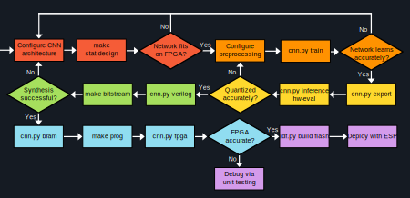

[](https://github.com/Brmanzo/esp-computer-vision/actions/workflows/test.yaml)

# ESP Computer Vision

Interfacing the ESP32c3 RUST board with an Arducam 2MP camera for image processing and computer vision.
RTL designed and tested on icebreaker V1.1a FPGA for hardware acceleration.

## Table of Contents


- [ESP Computer Vision](#esp-computer-vision)
  - [Table of Contents](#table-of-contents)
  - [Overview](#overview)
  - [Features So Far](#features-so-far)
  - [Milestones](#milestones)
  - [Bill of Materials](#bill-of-materials)
  - [Firmware Installation](#firmware-installation)
    - [Building the ESP Project](#building-the-esp-project)
  - [Hardware Installation](#hardware-installation)
  - [Neural Network](#neural-network)
    - [Setup](#setup)
    - [Design](#design)
    - [Training](#training)
    - [Synthesizing for Icebreaker Board](#synthesizing-for-icebreaker-board)
  - [Verification](#verification)
    - [Unit Testing](#unit-testing)
    - [Integration Testing](#integration-testing)
  - [Credits](#credits)
  - [License](#license)

## Overview

Computer vision is the process through which a neural network analyzes novel data and extracts meaningful information from its environment. Training these networks incurs a large initial cost, then once complete can be deployed in a static configuration. When these networks are mapped to Application-Specific Integrated Circuits (ASICs) they can perform inference much faster than in software due to specialized architecture and faster clock speed.
<br><br>
My goal for this project is to implement a dynamic system that captures live data and can interpret meaningful data from the real world. My current system bridges the gap between software and hardware, effectively utilizing the strengths of each domain. The ESP32c3 captures image data on its Arducam 2MP Camera, compresses each frame to one pixel per bit and transmits to the Icebreaker FPGA. Here the data image flows through the pretrained Convolutional Neural Network (CNN) resulting in a classification of the image subject. The ESP receives the result and publishes to local WiFi.

## Features So Far
- Frontend image compression
  - YUV422 Luma values interpreted as grayscale
  - Quantized from 256 values (8 bits) to as low as 2 (1 bit)
  - Down-sampling from default 320x240 down to 80x60
  - Periodic auto-exposure to adjust to changing light levels
  - Fault detection and recovery via reset-driven SYN/ACK polling
- Hardware acceleration of image processing via FPGA
  - Decoupled interface via UART for non-blocking transmission
  - Packet framing for proper data alignment
  - UART RTS line to ensure data integrity
  - Kernel-stationary sliding-window convolution architecture
  - Parameterized kernel size, stride, input and weight widths for network flexibility
  - Fully-Connected conv2d, linear, pool, and classifier modules verified with Pytorch
  - Layer Sequencing to allocate dynamic workloads to DSPs over time
- Pytorch Neural Network quantization
  - Weights quantized via progressive QAT and batchnorm folding
  - Binary activations quantized and encoded as {-1,1} via PACT
  - Wider activations 
  - Pytorch neural network automatically translated into system verilog hardware description.
- Unit and Integration Testing of all hardware components using CocoTB
- Dynamic HTML viewing of image over ESP32 Wi-Fi

## Milestones
- **2026-05-17** — Physically verified on FPGA via serial USB demo.
- **2026-05-08** — Sequenced Conv and Classifier layers to target Icestorm ROM and DSPs.
- **2026-05-03** — Verified Full CNN Integration in CocoTB using Pytorch
- **2026-04-26** — Verified Classifier Layer with Pytorch amax-linear-argmax output
- **2026-04-19** — Translate network specs into Pytorch Neural Network, Verilog, and Testbench
- **2026-04-06** — Mapped delay buffers to Icestorm BRAM, (8 channels/BRAM)
- **2026-03-08** — Quantized Weights and Activations in Pytorch Neural Network
- **2026-02-25** — Verified Linear Layer with PyTorch.Linear() output
- **2026-02-19** — Verified Pooling Layer with PyTorch.MaxPool() output
- **2026-02-17** — Verified Convolution Layer with PyTorch.Conv2d() output
- **2026-02-11** — Convolution Layer with N Input and M Output Channels
- **2026-01-27** — FPGA packet data framing
- **2026-01-13** — Streaming raw grayscale image
- **2026-01-03** — Bit-packing hardware to support quantized bitstream
- **2025-12-18** — ESP–FPGA integration via UART loopback
- **2025-12-10** — Edge detection on FPGA using sliding-window filters
- **2025-08-22** — Quantization and run-length encoding
- **2025-08-17** — Convolution and image differencing (software)
- **2025-08-12** — Web server integration
- **2025-07-27** — JPEG image decoding from Arducam

## Bill of Materials
- 1 [ESP32c3 RUST Dev Board](https://www.digikey.com/en/products/detail/espressif-systems/ESP32-C3-DEVKIT-RUST-1/17883272)
- 1 [Arducam Mini 2MP Plus - OV2640 SPI Camera Module](https://www.arducam.com/arducam-2mp-spi-camera-b0067-arduino.html)
- 1 [Icebreaker FPGA V1.1a](https://1bitsquared.com/products/icebreaker?srsltid=AfmBOooW6iLzoyD-4AgGGWnSkeym8laQqy-KYlYx5T9ydV_uMVwLNnr3)
- 1 [Tactile Switch](https://www.adafruit.com/product/367?srsltid=AfmBOopXJDkwZZ3xhYzoRondXTCAUdlD5mo5Dscsqsx_aSRLQ7fGItza)
- 1 [10KΩ Resistor](https://www.mouser.com/ProductDetail/KOA-Speer/MF1-4DCT52R1002D?qs=N%252ByFMz%252BPAuUNYagYAcIWwQ%3D%3D&srsltid=AfmBOopf6QByeJrdJKKnI24gIPw9OYOuHk75J2uJObQ4Vzyd8SYryvey)
- [Wire Jumpers](https://www.mouser.com/ProductDetail/Bud-Industries/BC-32626?qs=35lE6QEawPl6Nhk5Cl2jpw%3D%3D&mgh=1&utm_id=22173219802&utm_source=google&utm_medium=cpc&utm_marketing_tactic=amermsp&gad_source=1&gad_campaignid=22282221042&gclid=CjwKCAiA1obMBhAbEiwAsUBbIheD_8AtmTq2KaObIIA5rpbOFelhm25I9fOf8Q4eUZeYwtdDEaLhrxoCDswQAvD_BwE)

## Firmware Installation
| Component           | Version                     |
| ------------------- | --------------------------- |
| Espressif toolchain | v6.1 (dev-1280-gb33c9cd7ce) |

```bash
# Clone the repository
git clone git@github.com:Brmanzo/esp-computer-vision.git
cd esp-computer-vision

# Wiring
CS     - GPIO_NUM_7
MOSI   - GPIO_NUM_6
MISO   - GPIO_NUM_5
SCK    - GPIO_NUM_4
GND    - GND
VCC    - 3v3/5V
SDA    - GPIO_NUM_10
SCL    - GPIO_NUM_8

Button - GPIO_NUM_3
```

### Building the ESP Project
```bash
# Source the ESP-IDF Toolchain
source ~/esp/export.sh

# Open the ESP Project Directory
cd ~/esp/esp-computer-vision/firmware

# Target the ESP32c3 Board, then build and flash
idf.py set-target esp32c3
idf.py build flash monitor
```

## Hardware Installation
| Component              | Version              |
| ---------------------- | -------------------- |
| Yosys                  | 0.57 (git 3aca86049) |
| nextpnr-ice40          | 0.6-3build5          |
| Verilator              | 5.020                |
| Icarus Verilog         | 12.0                 |
| Verible                | v0.0-4051-g9fdb      |
| cocotb                 | 1.9.1                |
| Python                 | 3.12.3               |
| Netlistsvg             | 1.0.2                |
| librsvg (rsvg-convert) | 2.58.0               |

```bash
# Within a Python virtual environment run
pip install -r requirements.txt

# Then add utilities.py to path
export PYTHONPATH="$(git rev-parse --show-toplevel)/sim/util/:$PYTHONPATH"

# Wiring
ESP32c3       icebreakerV1.1a
GPIO_NUM_21 - GPIO  4 (PMOD1A)
GPIO_NUM_20 - GPIO  2 (PMOD1A)
GPIO_NUM_1  - GPIO 47 (PMOD1A)
GPIO_NUM_2  - GPIO 45 (PMOD1A)
GND         - GND     (PMOD1B)
```


## Neural Network 
### Setup

```bash
# To setup the cnn.py environment run
bash install.sh
source ~/.bashrc

# Create a new directory and config under tasks
mkdir nn/tasks/<TASK_NAME>
```

```python
# Within <TASK_NAME>/<TASK_NAME>.py elaborate nn_config, network_path, and classes

# Within <TASK_NAME>/preprocess.py elaborate your preprocessing and training transformations

# Include these structures in nn/globals.py and hook them to the global generics
CURRENT_TASK = "TASK_NAME"

if CURRENT_TASK == "TASK_NAME":
    # Hand Gesture Task
    NET_PATH       = <TASK_NAME>_NET_PATH
    CLASSES        = <TASK_NAME>_CLASSES
    NN_CFG         = get_<TASK_NAME>_cfg()
    prepare_data   = _prepare_<TASK_NAME>_data
    get_transforms = _get_<TASK_NAME>_transforms
```

### Design
```python
# Schedule the weight quantization per layer using QSchedule
  QSchedule(
    # Epoch to conclude full precision weights, and begin quantization
    40,
    # Epochs to train on every quantized bit-width, from initial to final 
    [5, 5, 5, 10, 20],
    # Initial quantized weight bit-width
    8,
    # Final quantized weight bit-width
    4
  )
```

```python
# In globals.py, customize the network architecture using NNConfig
# Specifies Pytorch neural network, cnn.sv, and functional verification model
  NNConfig(
    input_dimensions = InputDimensions(img_w, img_h),
    # Input Channels per layer, length determines network size
    in_channels      = [1, 4, 5, 7],
    # Input Activation width per layer, clamped and rounded to signed int
    in_bits          = [1, 1, 1, 5],
    # Conv_layer kernel width and optional pool_layer kernel width per layer
    kernels          = [[3,2], [3,2], [3,2], [1]],
    # Padding for all Conv_layers, can be int or list
    padding          = 1,
    # Stride for all Conv_layers, can be int or list
    stride           = 1,
    # Output width of classifier (number of classes)
    num_classes      = num_classes,
    # Output width of final class ID
    bus_width        = 8,
    # Bias width per layer, can be int or list
    bias_bits        = [8, 8, 8, 32],
    # Progressive Quantization Scheduling per layer
    q_schedule       = [QSchedule(40, [5, 5, 5, 10, 20], 8, 4),
                        QSchedule(50, [5, 5, 5, 10, 20], 8, 4),
                        QSchedule(60, [5, 5, 5, 10, 20], 8, 4),
                        QSchedule(70, [50], 8, 8)],
    # Optional SB_MAC16 DSP allocation per layer
    # (0 = default comb logic, 1 = 1 DSP per channel, 2 = 1 DSP per layer)
    use_dsp          = [0, 0, 1, 2]
  )
```

```bash
# To report BRAM and DSP Usage, performance analysis, and print network architecture
cnn.py arch

# To estimate LC, DFF, CARRY, RAM, and DSP cost from design spec via Yosys
make stat-design

# To report hardware cost for individual modules to command line
make stat-param MOD=<MODULE_NAME> PARAMS="P1=V1 P2=V2"

# To sweep a range of parameters and report hardware cost for individual modules to command line
make stat-sweep MOD=<MODULE_NAME> SWEEP=<PARAMETER_TO_SWEEP>=<START:END> PARAMS="P1=V1 P2=V2"

# To report hardware cost for individual modules to csv
make stat-sweep MOD=<MODULE_NAME> SWEEP=<PARAMETER_TO_SWEEP>=<START:END> PARAMS="P1=V1 P2=V2" PARSE_FLAGS="--csv" > <FILENAME>.csv

# To fold DFF primitives and CARRY/LUT4
make stat-sweep MOD=<MODULE_NAME> SWEEP=<PARAMETER_TO_SWEEP>=<START:END> PARAMS="P1=V1 P2=V2" PARSE_FLAGS="--fold"
```

### Training
```bash
# To sample a preprocessed dataset item
cnn.py sample <INDEX>

# To train the neural network using the specs in globals.py
cnn.py train

# To fine tune the neural network post-training
cnn.py train --finetune

# To export neural network weights to verilog header file
cnn.py export

# To generate random weights for testing FPGA util
cnn.py export --random

# To evaluate quantized neural network accuracy
cnn.py inference hw-eval --trials <TRIAL_NUM>
```

### Synthesizing for Icebreaker Board
```bash

# To render the cnn.sv from the specs in globals.py
cnn.py verilog

# To generate a schematic of the hardware run
make <MODULE>.pdf

# To estimate the LC, FF, RAM, and DSP cost run
make stat-design

# Within repo root run
make bitstream ESP=[0|1]

# To check FPGA resource utilization
make util && make stat

# To run interactive place and route
LIBGL_ALWAYS_SOFTWARE=1 nextpnr-ice40 --up5k --package sg48 --pcf boards/icebreakerV1_1a/icebreaker.pcf --gui --json ice40.json

# Then flash the resulting ice40.bin using
make prog ice40.bin

# To verify ROM hexfiles written to FPGA
cnn.py bram

# To verify via FPGA with USB serial I/O
make bitstream ESP=0
cnn.py fpga <sample_idx> [ttyUSBx] [--trials N]

# To clean the current repository
make clean
```
## Verification
### Unit Testing
```bash
# within sim/unit_testing/ open the module you'd like to test, then run
make test VERBOSE=[0|1]

# List available tests
make list-tests

# Run specific test(s) via keyword
make test <KEYWORD>

# To test icestorm dsp sequential modules
cd sim/unit_testing/filter && make test DSP=1
cd sim/unit_testing/neuron && make test DSP=1

# Lint module and dependencies with Verilator and Verible
make lint

# To test all unit tests alphabetically from root
make test-all FROM=<START_TEST_NAME>

# To lint all RTL from root
make lint-all

# To clean all test artifacts from root
make clean-all
```

### Integration Testing
```bash

# To run a smoke test for cnn
cd sim/integration_testing/cnn/ && make test INJECT_PIXELS=[zeros|ones]

# To verify cnn via functional model and pytorch
cd sim/integration_testing/cnn/ && make test <SAMPLE_IDX=#> VERBOSE=1

# To verify cnn within deframer, framer pipeline
cd sim/integration_testing/cnn/ && make test <SAMPLE_IDX=#> VERBOSE=1
```

## Credits
| Author                      | Source                                                                            |
| --------------------------- | --------------------------------------------------------------------------------- |
| Arducam                     | [RPI Pico Cam Project](https://github.com/ArduCAM/RPI-Pico-Cam)                   |
| Alex Forencich              | [Verilog-Uart Interface](https://github.com/alexforencichverilog-uart)            |
| Dustin Richmond             | [CSE 225 ASIC Design Course](https://courses.engineering.ucsc.edu/courses/cse225) |
| Claire Wolf, Mathias Lasser | [Project IceStorm](https://prjicestorm.readthedocs.io/)                           |

## License

This project is licensed under the MIT License. See [esp-computer-vision/LICENSE.md](LICENSE) for details.

